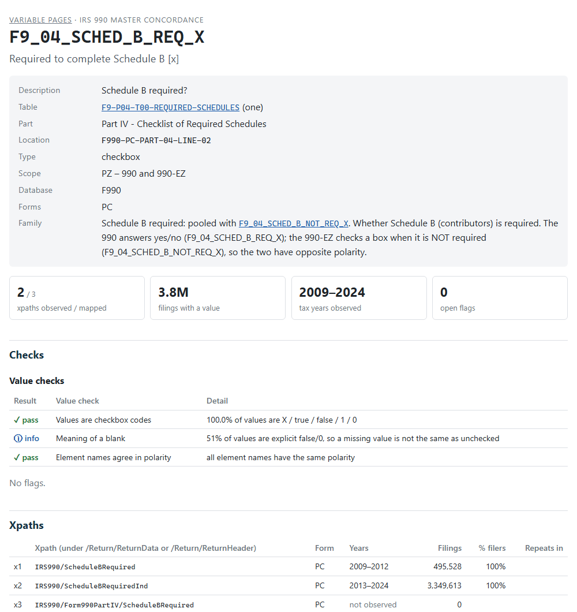

```{r setup, include = FALSE}
knitr::opts_chunk$set(collapse = TRUE, comment = "#>")
library(concordance990)
library(data.table)
page <- function(v) sprintf("[`%s`](%s)", v, variable_page_url(v))
```

The data dictionary says what a variable should hold. The **validation
pages** show what it does hold. There is one page for every variable in the
990 and 990-PF databases, built from the e-filed returns of tax years
2009-2024. Open a page when you have a question the dictionary can't answer:

* Which xpaths feed this column, and in which years was each one used?
* Why is the variable empty in 2012, or for 990-EZ filers?
* Are the values dollars, a fraction or a percent? Text, or a code?
* Has anyone reviewed the flags on it, and what did they decide?
* What does a real filing look like? (Every page links to example XML.)

The pages are on the package website, starting from the
[index](`r variable_page_url()`), which lists the forms and schedules. Each
form's index lists its variables by table.

## Opening a page from R

`dd()` looks up the dictionary (see `vignette("looking-up-variables")`). Add
`report = TRUE` to open the variable's page in your browser:

```{r, eval = FALSE}
dd("F9_01_REV_TOT_CY", report = TRUE)
```

For a table, `report = TRUE` opens the table's section of its form index,
which lists every variable of the table and links to each page:

```{r, eval = FALSE}
dd("F9-P01-T00-SUMMARY", report = TRUE)
```

`variable_page_url()` returns the address without opening it:

```{r}
variable_page_url("F9_01_REV_TOT_CY")
variable_page_url(table = "F9-P01-T00-SUMMARY")
```

## Reading a page

```{r, echo = FALSE, out.width = "100%", fig.alt = "The top of the validation page of F9_04_SCHED_B_REQ_X: the dictionary entry, four headline tiles, and the value checks."}

```

A page has seven parts. The examples link to live pages.

**1. The dictionary entry.** The same attributes `dd()` prints: description,
table (linked to the dictionary), part, location code, type, scope, the
database and the return types the xpaths come from. Variables pooled into a
family of alternate versions of one line link to each other, with the
family's definition (`r page("F9_04_SCHED_B_REQ_X")`).

**2. Headline numbers.** The xpaths observed in filings out of those mapped,
the filings with a value, the tax years observed, and the open flags.

**3. Checks.** Two kinds:

* **Value checks** test the values against what the variable's type implies.
  Amounts and numbers should parse as numbers, with no sudden change in the
  median between years, and pooled xpaths should be on one scale. Checkboxes
  should hold checkbox codes, with names that agree in polarity. Dates should
  use one format, identifiers the expected pattern, and codes a short list.
  Each check shows **pass**, **warn**, **fail** or **info**.
* **Flags** test the mapping against the filings: two xpaths of one variable
  filled in the same filing, opposite meanings pooled, a value that repeats in
  a one-row table, years with no data. Every flag shows the reviewer's
  decision from `validation_log.csv`: **open**, **accepted** (with the
  reviewer's note; click *note*), **needs input** or **deferred**.

The checks and flags, with what each one tests:

```{r, echo = FALSE}
cat_ <- issue_catalog[family %in% c("evidence", "value") & !check %in% c("UNMAPPED", "UNOBSERVED"),
                      .(Check = check, Severity = severity, `What it means` = name)]
knitr::kable(cat_)
```

A failed check is a question, not a verdict. `r page("SA_03_PCT_INVEST_INCOME_CY")`
(investment income percentage, Schedule A) fails *Pooled xpaths are on the
same scale*: the medians of its 2009-2012 and 2013-2024 xpaths differ 13x. The
next check shows both xpaths are fractions (0-1), and the value summary shows
why the ratio is large: over half the values are 0 and the median is near
zero, so a small difference is a large ratio. Nothing is wrong with the
mapping.

**4. Xpaths.** Every xpath pooled into the variable, oldest first, numbered
`x1`, `x2`, ... for the coverage grid: the form, the years it appears in
filings, the number of filings, the percent of filers reporting it in its
latest year (`% filers`), and how often it repeats within a filing. Xpaths
*not observed* are in the IRS schemas but in no filing.

**5. Coverage by tax year.** A grid of filings with a value, by xpath (rows)
and tax year (columns); hover a cell for the exact count. A change of row
from one year to the next is the IRS renaming the element; most were renamed
in 2013. Below it, the **fill rate**: the share of all filings of each return
type that have a value. When several xpaths can sit in one filing (the Part
III programs, `r page("F9_03_PROG_DESC")`), the fill rate counts the largest
xpath, so it is a lower bound.

**6. Values.** A summary that fits the type:

| Type | Summary |
|---|---|
| amount, number | % numeric, zero and negative; 25th, 50th, 75th and 99th percentiles by return type |
| checkbox, code | the most common values and their shares (how a checkbox is coded: `X`, `true`, `1`, ...) |
| date, identifier | the formats of the values (`9` a digit, `A` a letter): `99-9999999` for an EIN |
| text | average and longest length, and the most common values (boilerplate) |

**7. Example filings.** The most recent filing for each xpath, with the
organization, the value and a link to the XML of the return on the IRS
e-file data lake. This is the quickest way to see an xpath in context.

## How the pages are built

The pages are built from the **filing evidence**: counts, value summaries and
example filings for every xpath in every tax year, extracted from the ef2
DuckDB builds by `build_evidence()`. The evidence is large (several GB) and is
not part of the package. `data-raw/render-variable-pages.R` recomputes the
flags for the current concordance and writes the pages:

```{r, eval = FALSE}
source("data-raw/render-variable-pages.R")  # about 2 minutes
```

Each page is a small static HTML file (median 9 KB, all pages about 33 MB)
with no charting library: the coverage grid is a shaded table, and all pages
share one stylesheet. When the site is built, pkgdown adds a Markdown copy of
each page for AI tools (`llms.txt`; about 14 MB). The pages are in
`docs/variables/`, one folder per form or schedule prefix (`F9`, `PF`, `SA`
... `SR`); the largest folder has about 1,900 files, under GitHub's
recommended limit of 3,000 per folder. A rebuild touches every page: commit
it on its own, apart from code changes.

The full validation reports of `render_reports()` (charts, every year in
detail) are kept for reviewers; they are about 150 KB each and are rendered
for chosen variables only.
